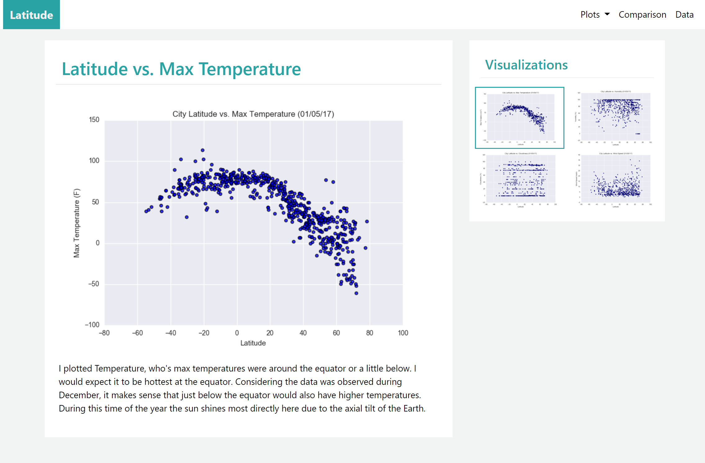

# Equator Weather Vacation Website of Findings
I wanted to create a website for the graphs and findings of our Coordinates vs Climate analysis. I built the table using used bootstrap's containers, navbars, and row/column layout to create a pleasing asthetic. 

The navabar was pulled from the bootstrap library and then adjusted to be "centered-right." I used the hamburger-icon when the screen was below the "md" size of pixels. I also changed the brand logo to be bold and white, while changing the background color of the navbar to be the theme color when the screen goes below "md" pixels.

I included an active navigation within the plots to show which plot you are viewing. They appear to the right of the plot when you are viewing when viewing from a screen larger than the "md" size. The image hyperlinks then move to the bottom of the screen when viewing on a smaller device.

All other style adaptations were defined in the "style.css" sheet.

The data and analyis was pulled from my <a href="https://github.com/emmobley63/Equator-Weather-Vacation">Equator-Weather-Vacation repository</a>. 
